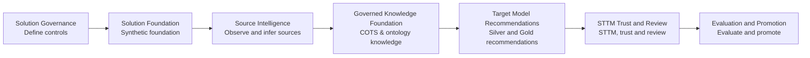

# Detailed implementation plan — Agentic Insurance Domain Solution

## 1. Purpose and delivery outcome

Build a governed, recommendation-only solution that analyzes approved source metadata and evidence, creates a reviewable source data dictionary, maps concepts to a federated insurance ontology, and recommends Silver ODS models, Gold data products, and source-to-target mappings (STTMs).

The first implementation is an **environment-neutral Databricks MVP** using synthetic data only. It proves the workflow and artifact contracts before any real organizational data is considered.

### MVP success statement

For one synthetic P&C source and a bounded Policy/Claims scope, the solution produces a versioned source-observation dictionary, records evidence and confidence for every proposed meaning, and routes ambiguous or privacy-relevant entries to a human review queue.

## 2. Delivery guardrails

- **Recommendation-only:** no agent deploys schemas, runs transformations against operational data, or modifies source systems.
- **Synthetic development safety:** use synthetic data and approved public learning material only. Do not use client data, PII, proprietary COTS documentation, credentials, or production connection strings.
- **Evidence first:** physical source observations, semantic inference, confidence, assumptions, and approvals must remain separate fields.
- **Human authority:** an architect, domain steward, or privacy steward approves material recommendations.
- **Versioned artifacts:** every run records the source scope, knowledge versions, run ID, artifact version, and reviewer decision.
- **Small vertical slices:** prove one capability end to end before adding the next agent or domain.

## 3. Target implementation sequence

## 4. Solution Governance — Scope and control decisions

**Objective:** create a controlled build boundary before any source or knowledge asset is added.

| Activity | Deliverable | Owner | Exit condition |
|---|---|---|---|
| Select the governed source scope | Source/product/module/version decision record | Data architect | One source family and one scope are named. |
| Select the domain boundary | Policy or Claims first-release scope | Architect + domain steward | In-scope and excluded objects are explicit. |
| Define permitted evidence | Evidence-classification matrix | Privacy steward + platform owner | Metadata, profile, sample, and narrative rules are signed off. |
| Name reviewers | RACI and service-level target | Architecture lead | Architect, domain steward, and privacy reviewer are available. |
| Define evaluation approach | Labelled test-set plan and confidence policy | Evaluation owner | Review decisions can be used to measure quality. |
| Define success targets | Evaluation and promotion scorecard | Sponsor | Quality, cost, latency, and throughput targets are agreed. |

### Required decisions

1. Which product, module, version, and domain/LOB forms the governed scope?
2. Which users can read metadata and approved profiles?
3. Which evidence classes may be indexed, retained, or used as prompt context?
4. What score requires mandatory review?
5. What is the expected reviewer turnaround time?
6. What signals constitute a continue, stop, or promotion decision?

## 5. Solution Foundation — Synthetic MVP foundation

**Objective:** prove the recommendation workflow against configured existing source tables and establish durable artifact schemas. Synthetic source creation is an optional, separate demonstration process and is not part of the solution boundary.

### Current code deliverables

| Notebook | Responsibility | Output |
|---|---|---|
| `00_config.py` | Defines existing source scope, output location, run ID, version, and threshold. | Reusable configuration. |
| `01_validate_source_scope.py` | Verifies configured source tables through read-only metadata access. | Source preflight result. |
| `02_build_source_dictionary.py` | Runs deterministic source intelligence rules. | `source_observation_dictionary`. |
| `03_generate_source_documentation.py` | Uses governed metadata context to propose column descriptions and glossary terms through a configured Databricks model. | `source_documentation_recommendation`. |
| `04_create_review_queue.py` | Routes uncertain, relationship, privacy, and LLM-assisted documentation items. | Canonical `source_intelligence_review_queue` and consumer-facing `review_queue` projection. |
| `05_validate_source_intelligence.py` | Validates artifact completeness and no auto-approval. | Run summary and validation result. |

### Foundation tasks

- Deploy `src/workflows/source_intelligence/` as the workflow entry-point notebooks.
- Supply source and output scope through governed DAB/job parameters; `00_config.py` validates them and owns versions and thresholds.
- Run the five notebooks in README order.
- Inspect the data dictionary and reviewer queue.
- Capture screenshots or query results as the MVP evidence pack.

For demonstrations only, `examples/synthetic_bronze/` may provision a disposable synthetic source in a separate job. The core workflow never invokes it.

### Solution Foundation acceptance gate

- All configured source tables pass read-only preflight and both recommendation output tables exist.
- Every dictionary row includes physical type, proposed meaning, confidence, privacy classification, run ID, and approval state.
- No dictionary row is automatically approved.
- At least one relationship and one privacy-relevant entry reach the review queue.
- The validation notebook completes successfully.

## 6. Source Intelligence — Source Intelligence Agent v1

**Objective:** replace the initial static rules with a reusable, transparent source-analysis service.

### Build scope

| Capability | Implementation detail | Output |
|---|---|---|
| Metadata extraction | Read Unity Catalog table, column, key, comment, and lineage metadata through approved read-only queries. | Source observation records. |
| Profile extraction | Compute null rate, distinct count, patterns, min/max, and controlled value summaries. | Profile-evidence records. |
| Relationship inference | Compare identifier naming, compatible types, overlap ratios, and documented constraints. | Relationship candidates. |
| Classification rules | Map object and attribute patterns to Policy, Claims, Billing, Party, Product, Coverage, and Reference Data. | Proposed domain classifications. |
| Privacy rules | Detect direct identifiers and sensitive-field names; prohibit value-level inspection unless approved. | Privacy classification and rationale. |
| Source documentation | Use strict structured LLM output over prompt-eligible structural context to propose column descriptions and glossary entries. | Source documentation recommendations requiring Domain Steward review. |
| COTS recognition | Compare source naming/structure to authorized product/version patterns. | Match assessment and customization candidates. |

### New tables

| Table | Purpose |
|---|---|
| `source_object_observation` | Object-level schema, profile, and recognition findings. |
| `source_attribute_observation` | Attribute-level facts and proposed semantics; successor to the MVP dictionary table. |
| `relationship_candidate` | Proposed keys/relationships with evidence and confidence. |
| `profile_evidence` | Approved, minimized profile summaries and evidence references. |
| `source_intelligence_run` | Run status, scope, context versions, metrics, and error information. |
| `source_documentation_recommendation` | Proposed column descriptions and business-glossary entries with context fingerprint, prompt/model provenance, and human-review state. |

### Tests

- Unit-test classification and privacy rules with known synthetic examples.
- Test repeated runs with the same input to verify idempotent output.
- Test missing metadata, conflicting key patterns, and incomplete profiles.
- Test that disallowed evidence classes are rejected before profiling or retrieval.

### Source Intelligence acceptance gate

- At least 90% of synthetic fields receive a proposed semantic classification.
- 100% of records retain physical metadata and evidence references.
- Known primary/foreign-key relationships are proposed with the expected evidence.
- Low-confidence and privacy-relevant entries are routed to review.

## 7. Governed Knowledge Foundation — Governed COTS knowledge and insurance ontology

**Objective:** add authorized, version-specific knowledge without treating model memory as authoritative.

**Execution package:** [`GOVERNED_KNOWLEDGE_FOUNDATION_WORK_PACKAGE.md`](GOVERNED_KNOWLEDGE_FOUNDATION_WORK_PACKAGE.md)

**Status:** READY — Source Intelligence gate passed on 2026-07-13. The active `insurance_ontology / 1.0.0` bundle covers functional insurance domains plus Motor, Home, Commercial Property, and isolated Pensions; the vendor-neutral synthetic `cots_like_suite / 1.0.0` baseline retains separate Policy Admin, Claims Management, and Billing packs. Real-vendor claims remain prohibited until an exact licensed pack is authorized in a customer environment.

### Knowledge-pack structure

| Artifact | Required fields |
|---|---|
| `knowledge_document` | Document ID, title, source, product, module, version, approval state, retention class. |
| `knowledge_concept` | Concept ID, definition, domain, LOB, synonyms, lifecycle state, owner. |
| `cots_structure_pattern` | Product, module, version, source object/field pattern, expected semantic concept, evidence reference. |
| `ontology_relationship` | From concept, relationship type, to concept, cardinality, approval state. |
| `knowledge_pack_version` | Pack ID, version, effective date, owner, approval status, changelog. |

### Delivery approach

1. Use the federated ontology root and separately governed domain/product-area modules; unsupported concepts remain unresolved.
2. Load only authorized, sanitized COTS reference material for one product/module/version.
3. Version every pack and require a knowledge owner.
4. Use structured lookup rules before semantic retrieval.
5. Introduce AI Search only after evidence classification and knowledge-pack controls are proven.

### Governed Knowledge Foundation acceptance gate

- Every COTS match identifies the exact product/module/version knowledge pack used.
- Unmatched structures are reported as customizations or unresolved; they are never forced into a known pattern.
- Standard concepts, specializations, source extensions, candidates, and unresolved items use distinct lifecycle states.

## 8. Target Model Recommendations — Ontology, Silver ODS, and Gold recommendation agents

**Objective:** move from understanding the source to recommending governed target models.

### Agent sequence

| Agent | Consumes | Produces |
|---|---|---|
| Ontology & Semantic Agent | Source observations, COTS patterns, ontology pack, reviewer decisions. | Source-to-ontology mapping package. |
| Silver ODS Modeling Agent | Approved semantic mappings, Silver standards, source lineage and history rules. | Entity, attribute, key, relationship, history, and privacy recommendations. |
| Gold Data Product Agent | Approved Silver recommendation, consumer use cases, Gold standards, derivation rules. | Facts, dimensions, grain, measures, conformed dimensions, and data-product recommendations. |

### New tables

| Table | Purpose |
|---|---|
| `ontology_mapping_recommendation` | Source-to-standard concept mapping with evidence and approval state. |
| `silver_entity_recommendation` | Canonical Silver entities and modelling rationale. |
| `silver_attribute_recommendation` | Canonical attributes, type, lineage, history, privacy, and source references. |
| `gold_data_product_recommendation` | Product definition, consumer, fact/dimension grain, measures, and derivations. |
| `recommendation_dependency` | Links an output to its source observations, knowledge packs, and upstream recommendations. |

### Modelling rules

- Standardize to the approved ontology before proposing a source-specific extension.
- Make target grain explicit for every Silver entity and Gold fact.
- Keep source lineage at attribute level.
- Separate approved business rules from inferred rules.
- Require review for keys, relationships, grain, derived financial measures, privacy class, and ontology extensions.

### Target Model Recommendations acceptance gate

- Each selected source object has an approved or unresolved ontology mapping.
- At least one Silver entity and one Gold data product are fully traceable to source observations.
- Each recommendation has evidence, confidence reasons, assumptions, contradictions, and a reviewer status.

## 9. STTM Trust and Review — STTM, trust evaluation, and human review

**Objective:** complete the governed recommendation lifecycle.

### STTM minimum schema

| Field group | Required contents |
|---|---|
| Scope | Source system, product/module/version, domain, LOB, mapping layer. |
| Source | Object, attribute, physical type, observed evidence. |
| Target | Object, attribute, target type, layer, ontology concept. |
| Logic | Transformation recommendation, rule reference, derivation description. |
| Trust | Observed/inferred state, confidence components, evidence, assumptions, contradictions, open questions. |
| Governance | Privacy class, owner, reviewer, approval state, rationale, version. |

### Trust-evaluation model

The confidence score must be derived from component evidence rather than LLM self-rating:

- Retrieval and knowledge-pack fitness
- Metadata and naming-pattern strength
- Type and relationship consistency
- COTS pattern match strength
- Enterprise-standard and rule consistency
- Contradiction detection
- Calibration against historical reviewer decisions

### Review workflow

1. Create a recommendation with `PROPOSED` status.
2. Run trust evaluation.
3. Route `NEEDS_CLARIFICATION`, low-confidence, privacy-relevant, and business-critical artifacts to the appropriate reviewer.
4. Reviewer chooses `APPROVED`, `MODIFIED`, `REJECTED`, or `DEFERRED` and records rationale.
5. Invalidate only downstream dependent artifacts after a material decision changes.
6. Publish approved artifacts as filtered, versioned context for future runs.

### STTM Trust and Review acceptance gate

- Every material recommendation appears in an approval record.
- Rejected or modified recommendations retain rationale and do not silently reappear unchanged.
- An affected Silver decision triggers targeted downstream re-evaluation rather than a full pipeline reset.

## 10. Evaluation and Promotion — Evaluation, operationalization, and promotion decision

**Objective:** decide whether the prototype is ready for a controlled business evaluation environment.

### Pilot scorecard

| Measure | How to measure | Target direction |
|---|---|---|
| Evidence completeness | Material recommendations with all required evidence/trust/governance fields. | 100%. |
| Mapping precision and recall | Compare recommendation results with a labelled reviewer set. | Improve against baseline. |
| Reviewer override rate | Materially changed/rejected recommendations ÷ reviewed recommendations. | Understand and reduce by iteration. |
| Reviewer throughput | Median time from recommendation to final decision. | Meet agreed service level. |
| Workflow reliability | Failed/retried runs and targeted-reprocessing success rate. | Demonstrate controlled recovery. |
| Cost and latency | Compute usage and elapsed time per source object and workflow stage. | Meet pilot budget. |
| Sensitive-evidence compliance | Inputs passing evidence-classification controls. | 100%. |

### Promotion criteria

Before using organizational data, move to an authorized customer environment. Promotion requires:

- A named business sponsor and data owner.
- An approved security, privacy, retention, and access-control design.
- Controlled source connectivity and service identities.
- A reviewed model-serving, AI Search, and monitoring design.
- A documented incident, rollback, and support model.
- Successful completion of the pilot scorecard.

## 11. Workstreams and roles

| Workstream | Accountable role | Supporting roles |
|---|---|---|
| Architecture and model standards | Data architect | Enterprise architect, data modeler |
| Domain semantics and COTS knowledge | Domain SME / data steward | Product SME, knowledge owner |
| Privacy and evidence controls | Privacy steward | Security, legal, platform owner |
| Databricks platform engineering | Platform engineer | Data engineer, MLOps engineer |
| Agent contracts and evaluation | AI/ML engineer | Data engineer, architect, steward |
| Review experience and adoption | Product owner | Reviewers, UX/BI developer |

## 12. Immediate next actions

1. Run the five MVP notebooks in the configured Databricks workspace.
2. Save the resulting table counts and screenshots from the validation notebook.
3. Decide whether the first real pilot will begin with Policy or Claims.
4. Create the evidence-classification matrix and name the three reviewer roles.
5. Evaluate the Source Documentation Agent against independently reviewed descriptions and glossary decisions before expanding its prompt context or adding retrieval.
